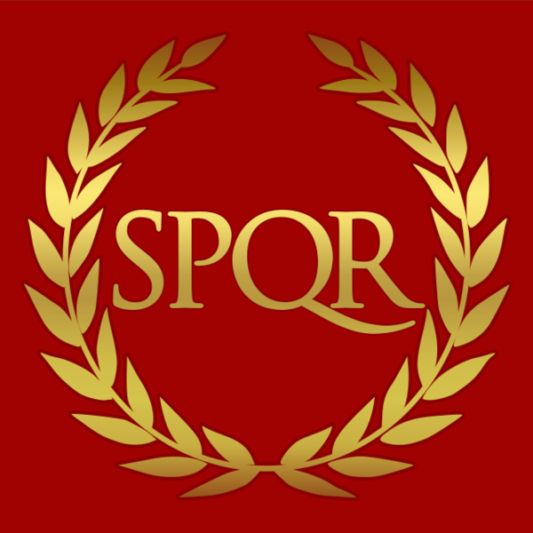

  <h1>PROJECT ROME</h1>

  </img>

  PThis is **official** GitHub organization for the Project Rome and the [@Rome](https://www.roblox.com/groups/33852218/Rome#!/about) Roblox Group.

 

**The Senate and People of Rome, the pride of the Ancient World.**

After the fall of the Roman Republic, the fallen republic was reborn.. into an Empire. One of the most powerful and advanced civilizations of her time was one of the greatest empires known to man. They achieved many great things such as Wealth, Power, Expansion, and success. Many feared Rome's power and threatened the Empire which has stood for so long. For Rome to put down these rebellions and conquer more land they go from land to land to put down barbarian hordes and other Nations to protect and expand their Empire, Will you be apart of greatness?

Rome offers a wide centralized idea of civilization to all newcomers that wish to experience true Roman culture and battle other nations for supremacy.

We strive for historical accuracy unlike any other group on the [@Roblox](https://www.roblox.com/) platform.

 

Be sure to join our communications [@Discord](https://discord.com/invite/ysXkrGxhJZ) server.
Made with ❤️ on 🌍 by humans.